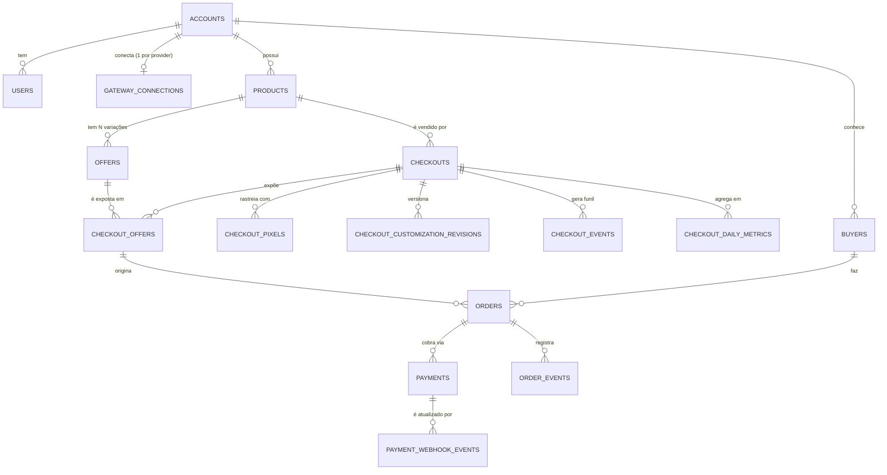

# LowCheckout — Modelo de dados

Derivado de [`../../lowcheckout-blueprint.md`](../../lowcheckout-blueprint.md). Complementa
[`requisitos-funcionais.md`](./requisitos-funcionais.md): aqui está **como os dados se relacionam**;
lá está **o que o sistema faz**. Em caso de divergência, o blueprint é a fonte da verdade.

Alvo: Postgres 18 via Drizzle ORM (`src/infra/persistence/drizzle/schema/`).

> **Reconciliado com o RF.** Três pontos deste documento foram ajustados para não conflitar com as
> suposições registradas em `requisitos-funcionais.md`: `products.default_delivery_url` passou a ser
> opcional (S3/S6), `accounts` ganhou `contact_email` separado do e-mail de login (S22), e a
> transição `expired → paid` foi admitida no pedido (S14). Onde os dois documentos falarem do mesmo
> assunto, o RF manda no **comportamento** e este documento manda na **forma de armazenar**.

---

## Convenções

Herdadas do schema atual (`checkouts.table.ts`) — vale para toda tabela nova:

| Assunto | Regra |
| --- | --- |
| PK | `id varchar(36)`, UUID gerado pela aplicação (`IdGenerator`), nunca `serial` |
| Nomes | tabela e coluna em `snake_case`; tabela no plural |
| Timestamps | `created_at` / `updated_at` — `timestamp with time zone`, `not null`, escritos pelo `Clock` (nunca `default now()`) |
| Dinheiro | `*_in_cents integer` + `currency varchar(3)`. Nunca `float`/`numeric` para valor |
| Enums | `pgEnum` derivado de uma constante do domínio (`CHECKOUT_STATUSES`), nunca string livre |
| Índices | `<tabela>_<colunas>_idx`; únicos `<tabela>_<coluna>_unique` |
| JSON | `jsonb` (não `json`) para customização, credenciais e payloads de webhook |
| Exclusão | *soft delete*: `status = 'archived'` no catálogo, `deleted_at` em `accounts`. `DELETE` físico só em tabelas de junção |

### Multi-tenancy

**Toda** tabela de negócio carrega `account_id`, inclusive as que poderiam derivá-lo por join
(`offers`, `checkout_offers`, `orders`). É desnormalização deliberada: o filtro por conta vira uma
cláusula direta em toda query e todo índice de listagem começa por `account_id`, o que impede
vazamento entre contas por um join esquecido. O custo é ter que manter o `account_id` coerente na
escrita — responsabilidade dos repositórios, que sempre recebem o `accountId` do caso de uso.

---

## Diagrama



---

## Relacionamentos e cardinalidades

| # | Relação | Cardinalidade | Onde vive a FK | Regra |
| --- | --- | --- | --- | --- |
| 1 | `accounts` → `users` | 1 : N | `users.account_id` | Login Google. Hoje na prática 1:1, modelado 1:N para permitir equipe depois sem migração destrutiva |
| 2 | `accounts` → `gateway_connections` | 1 : N (1 por provider) | `gateway_connections.account_id` | Gateway é **global da conta** — todo checkout herda. `unique(account_id, provider)` |
| 3 | `accounts` → `products` | 1 : N | `products.account_id` | |
| 4 | `products` → `offers` | 1 : N | `offers.product_id` | "Um produto pode ter N ofertas" |
| 5 | `products` → `checkouts` | 1 : N | `checkouts.product_id` | "Um checkout pertence a um produto"; o mesmo produto é reutilizável em vários checkouts |
| 6 | `checkouts` ↔ `offers` | N : N | `checkout_offers` | **Vínculo manual**: nenhuma oferta entra automaticamente num checkout existente |
| 7 | `checkout_offers` → URL pública | 1 : 1 | `checkout_offers.public_slug` | "1 URL pública por oferta" — o slug é único globalmente, é ele que a página pública resolve |
| 8 | `checkouts` → `checkout_pixels` | 1 : N (1 por provider) | `checkout_pixels.checkout_id` | Tracking é **por checkout** (cada checkout ≈ uma campanha), ao contrário do gateway |
| 9 | `checkout_offers` → `orders` | 1 : N | `orders.checkout_offer_id` | O pedido nasce de um par (checkout, oferta) concreto, não de uma oferta solta |
| 10 | `buyers` → `orders` | 1 : N | `orders.buyer_id` | Comprador não tem conta/painel; o registro serve para "lembrança" em compras futuras |
| 11 | `orders` → `payments` | 1 : N | `payments.order_id` | 1:N, não 1:1 — um PIX expirado pode ser regerado. No máximo um `pending` por pedido |
| 12 | `payments` → `payment_webhook_events` | 1 : N | `payment_webhook_events.payment_id` | Idempotência: `unique(provider, external_event_id)` |
| 13 | `checkouts` → `checkout_events` | 1 : N | `checkout_events.checkout_id` | Matéria-prima do funil por checkout |

### Duas invariantes que o banco sozinho não garante

**(a) A oferta vinculada tem que ser do mesmo produto do checkout.**
`checkouts.product_id` e `offers.product_id` podem divergir num vínculo malfeito. Duas defesas,
use as duas:

1. Domínio (obrigatório): o caso de uso `LinkOfferToCheckout` carrega checkout e oferta e recusa
   com `OfferProductMismatchError` se `offer.productId !== checkout.productId`.
2. Banco (recomendado): carregue `product_id` também em `checkout_offers` e amarre com FKs
   compostas — exige um índice único redundante em cada lado:

```sql
ALTER TABLE checkouts ADD CONSTRAINT checkouts_id_product_unique UNIQUE (id, product_id);
ALTER TABLE offers    ADD CONSTRAINT offers_id_product_unique    UNIQUE (id, product_id);

ALTER TABLE checkout_offers
  ADD CONSTRAINT checkout_offers_checkout_product_fk
  FOREIGN KEY (checkout_id, product_id) REFERENCES checkouts (id, product_id),
  ADD CONSTRAINT checkout_offers_offer_product_fk
  FOREIGN KEY (offer_id, product_id) REFERENCES offers (id, product_id);
```

Com isso, vincular oferta de outro produto passa a ser erro de integridade referencial, não só de
regra de negócio.

**(b) `accounts.status = 'active'` exige onboarding completo.**
O onboarding é bloqueante e cria a conta com campos ainda vazios, então `business_name`, `document`
e `phone` são `nullable` no schema. A obrigatoriedade é uma invariante da entidade `Account`
(`activate()` recusa se algum estiver ausente), não uma constraint `NOT NULL`. Opcionalmente,
reforce com `CHECK`:

```sql
ALTER TABLE accounts ADD CONSTRAINT accounts_active_requires_onboarding
  CHECK (status <> 'active' OR (business_name IS NOT NULL AND document IS NOT NULL AND phone IS NOT NULL));
```

**(c) Toda oferta precisa resolver um entregável.**
`offers.delivery_url` é opcional (herda do produto) e `products.default_delivery_url` também é
(RF-PROD-01 exige só o nome). Logo o schema admite um par sem entregável nenhum, e a página de
obrigado não teria o que entregar. A regra (S6) é **pelo menos um dos dois níveis preenchido**, e ela
tem *dois* pontos de escrita, não um:

1. ao salvar a oferta — recusa `delivery_url` vazio se o produto também não tiver padrão;
2. ao **editar o produto** — recusa limpar `default_delivery_url` enquanto existir oferta ativa que
   dependa do fallback (`offers.delivery_url is null`).

O segundo é o que costuma ser esquecido: sem ele, a oferta nasce válida e é invalidada à distância
por uma edição no produto. É uma invariante entre agregados — mora no caso de uso
`UpdateProduct`, não na entidade `Offer`. Não é expressável em `CHECK` (cruza tabelas); se quiser
rede de segurança no banco, use trigger ou aceite a validação só na aplicação.

---

## Tabelas

Legenda de prioridade: **MVP** = entra agora · **Schema** = tabela criada agora, sem caso de uso
ainda · **Pós-MVP** = só quando o módulo entrar.

### `accounts` — o tenant · MVP

| Coluna | Tipo | Notas |
| --- | --- | --- |
| `id` | `varchar(36)` PK | |
| `business_name` | `varchar(160)` | nullable até o fim do onboarding |
| `document` | `varchar(14)` | CPF/CNPJ **só dígitos**. Bloqueado para edição pelo usuário |
| `document_type` | `account_document_type` | `cpf` \| `cnpj` |
| `phone` | `varchar(20)` | E.164 sem formatação |
| `contact_email` | `varchar(255)` | e-mail **de contato**, editável em Configurações (RF-CONF-01). Não é o e-mail de login |
| `sells_what` | `varchar(255)` | opcional (onboarding) |
| `estimated_revenue` | `account_revenue_range` | opcional; faixa, não valor livre |
| `status` | `account_status` | `pending_onboarding` \| `active` \| `disabled` \| `deleted` |
| `onboarding_completed_at` | `timestamptz` | nullable |
| `created_at` / `updated_at` | `timestamptz` | |
| `deleted_at` | `timestamptz` | *danger zone*: desativar/deletar conta |

Índices: `unique(document) where deleted_at is null`.

### `users` — identidade Google · MVP

| Coluna | Tipo | Notas |
| --- | --- | --- |
| `id` | `varchar(36)` PK | |
| `account_id` | `varchar(36)` FK → `accounts.id` | `on delete cascade` |
| `google_sub` | `varchar(64)` | identificador estável do Google — **é a chave de login**, não o e-mail |
| `email` | `varchar(255)` | vem do Google, **imutável** pela aplicação. O e-mail que o usuário edita é `accounts.contact_email` (S22) |
| `name` | `varchar(160)` `not null` | vem do Google; editável (RF-CONF-01). O Google pode não mandar nome: o provisionamento cai para o e-mail — ver *Decisão* abaixo |
| `avatar_url` | `text` | nullable |
| `last_login_at` | `timestamptz` | nullable |
| `created_at` / `updated_at` | `timestamptz` | |

Índices: `unique(google_sub)`, `unique(email)`, `idx(account_id)`.
Não existe coluna de senha — login é exclusivamente Google.

> **Decisão (resolvida).** `name` continua `not null`. RF-AUTH-01 trata nome e foto do Google como
> opcionais, e o conflito foi resolvido no **provisionamento**, não no schema: `AuthenticateWithGoogle`
> usa o e-mail como fallback quando o perfil Google não traz `name` (`User.create` aplica
> `name ?? email`). O schema segue forte — nenhuma tela precisa lidar com usuário sem nome — e o
> `avatar_url` permanece `nullable`, que é o campo em que a ausência é normal e visível.
>
> Efeito colateral registrado: o nome é gravado **uma vez**, na criação. Logins seguintes não o
> sobrescrevem, porque RF-CONF-01 o torna editável pelo usuário e o Google não pode desfazer essa
> edição. Só `avatar_url` e `last_login_at` são atualizados a cada login.

### `refresh_tokens` — sessão · Schema

`id`, `user_id` FK, `token_hash varchar(64)` (SHA-256, **nunca** o token em claro), `expires_at`,
`revoked_at` nullable, `created_at`. Índices: `unique(token_hash)`, `idx(user_id, expires_at)`.
Só é necessária se a API emitir refresh token próprio; com JWT curto + re-login Google, pode ficar vazia.

### `products` · MVP

| Coluna | Tipo | Notas |
| --- | --- | --- |
| `id` | `varchar(36)` PK | |
| `account_id` | `varchar(36)` FK → `accounts.id` | |
| `name` | `varchar(120)` `not null` | |
| `description` | `text` | opcional |
| `image_url` | `text` | opcional |
| `default_delivery_url` | `text` | opcional (RF-PROD-01: só `name` é obrigatório) — é o fallback das ofertas; ver invariante (c) |
| `status` | `product_status` | `active` \| `archived` |
| `created_at` / `updated_at` | `timestamptz` | |

Índices: `idx(account_id, status, created_at)`.

### `offers` — variação comercial · MVP

| Coluna | Tipo | Notas |
| --- | --- | --- |
| `id` | `varchar(36)` PK | |
| `account_id` | `varchar(36)` FK | |
| `product_id` | `varchar(36)` FK → `products.id` | `on delete restrict` |
| `name` | `varchar(120)` `not null` | **uso interno**, não aparece na página pública |
| `price_in_cents` | `integer` `not null` | `> 0` |
| `currency` | `varchar(3)` `not null` | `BRL` |
| `delivery_url` | `text` | opcional — **override** do produto; `null` = herda `products.default_delivery_url` |
| `status` | `offer_status` | `active` \| `archived` |
| `created_at` / `updated_at` | `timestamptz` | |

Índices: `idx(account_id, product_id, status)`.
O preço mora **aqui**, não no checkout — o schema atual de `checkouts` contraria isso (ver *Impacto*).
`delivery_url` é hoje o único campo com padrão de override; o blueprint deixa em aberto se outros
campos ganharão o mesmo tratamento.

### `checkouts` · MVP

| Coluna | Tipo | Notas |
| --- | --- | --- |
| `id` | `varchar(36)` PK | |
| `account_id` | `varchar(36)` FK | |
| `product_id` | `varchar(36)` FK → `products.id` | `on delete restrict` |
| `internal_title` | `varchar(120)` `not null` | título interno, só no painel |
| `display_name` | `varchar(120)` `not null` | título da página pública + footer |
| `banner_desktop_url` | `text` | opcional |
| `banner_mobile_url` | `text` | opcional |
| `customization` | `jsonb` `not null` default `'{}'` | resultado do builder (inputs de cor) **e** do "Importar JSON" — mesma coluna, dois caminhos de escrita |
| `status` | `checkout_status` | `draft` \| `active` \| `paused` \| `archived` |
| `created_at` / `updated_at` | `timestamptz` | |

Índices: `idx(account_id, status, created_at)`, `idx(product_id)`.
Sem `slug` e sem preço: a URL pública é por oferta (`checkout_offers.public_slug`) e o preço é da oferta.

### `checkout_customization_revisions` · Pós-MVP

`id`, `checkout_id` FK, `customization jsonb`, `source` (`builder` \| `json_import` \| `ai`),
`created_by_user_id` FK, `created_at`. Existe para dar reversão ao "Importar" — que sobrescreve a
customização atual e por isso pede confirmação na UI. Índice: `idx(checkout_id, created_at desc)`.

### `checkout_offers` — vínculo manual + URL pública · MVP

| Coluna | Tipo | Notas |
| --- | --- | --- |
| `id` | `varchar(36)` PK | |
| `account_id` | `varchar(36)` FK | |
| `checkout_id` | `varchar(36)` FK → `checkouts.id` | `on delete cascade` |
| `offer_id` | `varchar(36)` FK → `offers.id` | `on delete restrict` |
| `product_id` | `varchar(36)` FK | redundante, sustenta as FKs compostas da invariante (a) |
| `public_slug` | `varchar(160)` `not null` | **a URL pública**; único globalmente |
| `position` | `integer` `not null` default `0` | ordem de exibição |
| `is_active` | `boolean` `not null` default `true` | desliga a URL sem desfazer o vínculo |
| `created_at` / `updated_at` | `timestamptz` | |

Índices: `unique(public_slug)`, `unique(checkout_id, offer_id)`, `idx(checkout_id, position)`.
Esta é a tabela mais quente do sistema: é ela que a página pública resolve por `public_slug` a cada
acesso. O `unique(public_slug)` é o índice desse caminho.

### `checkout_pixels` — tracking por checkout · MVP

`id`, `account_id`, `checkout_id` FK (`on delete cascade`), `provider` (`facebook` \| `utmify`),
`external_id varchar(120)` (pixel ID), `access_token text` nullable (**criptografado**, ver *Segredos*),
`config jsonb` default `'{}'`, `is_enabled boolean`, `created_at` / `updated_at`.
Índice: `unique(checkout_id, provider)` — um pixel por provider por checkout.

### `gateway_connections` — gateway global da conta · Schema

`id`, `account_id` FK (`on delete cascade`), `provider` (`efibank`),
`environment` (`sandbox` \| `production`), `status` (`connected` \| `disconnected` \| `error`),
`credentials jsonb not null` (**criptografado**), `pix_key varchar(160)` nullable,
`last_error text` nullable, `connected_at`, `last_checked_at`, `created_at` / `updated_at`.
Índice: `unique(account_id, provider)`.
Conecta uma vez, todo checkout da conta herda — por isso a chave é `account_id`, não `checkout_id`.

### `buyers` — comprador (sem conta) · Schema

`id`, `account_id` FK, `name varchar(160)`, `email varchar(255)`, `document varchar(11)` (CPF, só
dígitos), `created_at` / `updated_at`.
Índices: `unique(account_id, email)`, `idx(account_id, document)`.
Escopo por conta de propósito: o mesmo CPF comprando de dois lojistas são dois registros. Comprador
não tem painel nem login.

Atenção ao que esta tabela **não** é: a "lembrança" dos dados em compras futuras (RF-PUB-07, Pós-MVP)
é local ao navegador do comprador (S12), nunca uma consulta a esta tabela — preencher um formulário
com dados de um CPF digitado seria vazamento de dado pessoal. `buyers` existe para dar ao lojista o
registro de quem comprou dele. Dado pessoal — ver *LGPD*.

### `orders` — pedido · Schema

| Coluna | Tipo | Notas |
| --- | --- | --- |
| `id` | `varchar(36)` PK | |
| `account_id` | `varchar(36)` FK | |
| `checkout_offer_id` | `varchar(36)` FK → `checkout_offers.id` | `on delete restrict` |
| `checkout_id`, `offer_id`, `product_id` | `varchar(36)` FK | denormalizados para o funil e o ranking sem 3 joins |
| `buyer_id` | `varchar(36)` FK → `buyers.id` | |
| `status` | `order_status` | `awaiting_payment` \| `paid` \| `expired` \| `canceled` \| `refunded` |
| `amount_in_cents` / `currency` | `integer` / `varchar(3)` | **snapshot** |
| `product_name_snapshot` | `varchar(120)` | **snapshot** |
| `offer_name_snapshot` | `varchar(120)` | **snapshot** |
| `delivery_url_snapshot` | `text` | **snapshot** do fallback já resolvido (oferta → produto) |
| `buyer_name` / `buyer_email` / `buyer_document` | | **snapshot** |
| `expires_at` | `timestamptz` | expiração do PIX |
| `paid_at` | `timestamptz` | nullable |
| `delivery_sent_at` | `timestamptz` | nullable — o e-mail com o entregável ("também foi enviado por e-mail") |
| `created_at` / `updated_at` | `timestamptz` | |

Índices: `idx(account_id, status, created_at)`, `idx(checkout_id, created_at)`,
`idx(account_id, paid_at)` (faturamento por período), `idx(status, expires_at)` (job de expiração).

Os campos `*_snapshot` são o ponto central desta tabela: preço, nome e entregável são **copiados** no
momento da compra. Sem isso, editar uma oferta reescreveria o histórico de faturamento e mandaria o
comprador antigo para um entregável que não foi o que ele comprou.

Transições válidas: `awaiting_payment → paid` · `awaiting_payment → expired` ·
`awaiting_payment → canceled` · `paid → refunded` · **`expired → paid`**. Qualquer outra é
`InvalidOrderTransitionError`.

`expired → paid` existe porque o job de expiração e o webhook do gateway são assíncronos e podem se
cruzar: o pedido pode ser marcado como expirado segundos antes de chegar a confirmação de um PIX que
o comprador pagou dentro do prazo. Nesse conflito o **pagamento confirmado prevalece** (RF-PAG-02,
suposição S14 — ainda por validar contra o comportamento real do EfiBank). Sem essa transição, uma
venda real viraria pedido expirado e sumiria do faturamento.

### `order_events` — trilha de transições · Schema

`id`, `account_id` FK, `order_id` FK (`on delete cascade`), `from_status order_status` **nullable**
(nulo no evento de criação), `to_status order_status not null`, `reason text` nullable,
`metadata jsonb not null` default `'{}'`, `occurred_at timestamptz`.
Índice: `idx(order_id, occurred_at)`.
Reusa o enum `order_status` nas duas pontas em vez de inventar um enum de evento. O `reason` existe
por causa do `expired → paid`: quando o webhook chega depois do job de expiração, é onde fica
registrado *por que* um pedido expirado voltou a pago.

### `payments` — cobrança PIX · Schema

`id`, `account_id`, `order_id` FK (`on delete cascade`), `provider` (`efibank`), `method` (`pix`),
`status` (`pending` \| `paid` \| `expired` \| `failed` \| `refunded`),
`external_charge_id varchar(120)`, `amount_in_cents`, `qr_code_image_url text`,
`qr_code_payload text` (copia-e-cola), `expires_at`, `paid_at`, `raw_payload jsonb`,
`created_at` / `updated_at`.
Índices: `unique(provider, external_charge_id)`, `idx(order_id, created_at)`,
`unique(order_id) where status = 'pending'` (parcial — garante um único PIX vivo por pedido).

### `payment_webhook_events` — idempotência · Schema

`id`, `provider`, `external_event_id varchar(160)`, `payment_id` FK nullable (nem todo evento casa
com um pagamento conhecido), `payload jsonb`, `status` (`received` \| `processed` \| `failed`),
`error text` nullable, `received_at`, `processed_at` nullable.
Índice: `unique(provider, external_event_id)`.
É esse único índice que torna o webhook idempotente: reentrega do gateway colide no insert e é
descartada antes de tocar o pedido.

### `checkout_events` — funil · Schema

`id`, `account_id`, `checkout_id` FK, `checkout_offer_id` FK nullable, `order_id` FK nullable,
`type` (`page_view` \| `checkout_started` \| `pix_generated` \| `payment_paid` \| `pix_expired`),
`visitor_id varchar(64)` (anônimo, do browser), `utm jsonb` nullable, `occurred_at timestamptz`.
Índices: `idx(checkout_id, type, occurred_at)`, `idx(account_id, occurred_at)`.
Alimenta o funil detalhado, a taxa de conversão e a **taxa de abandono do PIX** — métricas que o
blueprint restringe à página de cada checkout, não à home.

### `checkout_daily_metrics` — rollup · Pós-MVP

`account_id`, `checkout_id`, `day date`, `views`, `pix_generated`, `orders_paid`,
`revenue_in_cents`, `updated_at`. PK composta `(checkout_id, day)`.
Enquanto o volume for baixo, a home lê direto de `orders` e `checkout_events`. Esta tabela é a saída
quando `count(*)` sobre eventos parar de responder no seletor "30 dias".

---

## Rastreabilidade — RF → tabelas

| Módulo (RF) | Tabelas | Observação |
| --- | --- | --- |
| AUTH (RF-AUTH-01..04) | `users`, `accounts`, `refresh_tokens` | `google_sub` é a identidade; sem coluna de senha |
| ONB (RF-ONB-01..02) | `accounts` | `status = pending_onboarding` é o que torna o onboarding bloqueante |
| PROD (RF-PROD-01..04) | `products` | RF-PROD-04 (excluir) é Pós-MVP → `on delete restrict` + `archived` |
| OFER (RF-OFER-01..05) | `offers` | RF-OFER-02 (fallback) = invariante (c); RF-OFER-05 (não propagação) = `checkout_offers` manual |
| CHK (RF-CHK-01..06,10) | `checkouts`, `checkout_offers`, `checkout_pixels` | RF-CHK-05 (1 URL por oferta) = `unique(public_slug)` |
| CHK builder (RF-CHK-07..09) | `checkouts.customization`, `checkout_customization_revisions` | manual e JSON escrevem a **mesma** coluna; revisions dá reversão ao "Importar" |
| CHK IA (RF-CHK-11) | — | Pós-MVP, sem tabela (grava em `customization` como qualquer outra origem) |
| PUB (RF-PUB-01..08) | `checkout_offers`, `buyers`, `orders`, `payments`, `checkout_events` | RF-PUB-01 resolve por `public_slug`; RF-PUB-07 é browser-local, sem tabela |
| PAG (RF-PAG-01..06) | `orders`, `payments`, `order_events` | RF-PAG-06 (congelar dados) = colunas `*_snapshot` |
| GTW (RF-GTW-01..05) | `gateway_connections`, `payment_webhook_events` | RF-GTW-02 (idempotência) = `unique(provider, external_event_id)`; RF-GTW-03 (herança) = chave em `account_id` |
| ANL (RF-ANL-01..05) | `orders` | home lê de `orders` por `paid_at` (S19) |
| ANL funil (RF-ANL-06) | `checkout_events`, `checkout_daily_metrics` | Pós-MVP; exige registrar `page_view` na página pública (S21) |
| CONF (RF-CONF-01..04) | `accounts`, `users` | RF-CONF-01 edita `accounts.contact_email`; RF-CONF-02 congela `document`; RF-CONF-03/04 usam `status` + `deleted_at` |
| — (monetização) | — | fora do modelo por decisão em aberto |

---

## Enums

| Enum | Valores |
| --- | --- |
| `account_status` | `pending_onboarding`, `active`, `disabled`, `deleted` |
| `account_document_type` | `cpf`, `cnpj` |
| `account_revenue_range` | `up_to_10k`, `from_10k_to_50k`, `from_50k_to_100k`, `above_100k` |
| `product_status` | `active`, `archived` |
| `offer_status` | `active`, `archived` |
| `checkout_status` | `draft`, `active`, `paused`, `archived` (já existe) |
| `pixel_provider` | `facebook`, `utmify` |
| `gateway_provider` | `efibank` |
| `gateway_status` | `connected`, `disconnected`, `error` |
| `order_status` | `awaiting_payment`, `paid`, `expired`, `canceled`, `refunded` |
| `payment_status` | `pending`, `paid`, `expired`, `failed`, `refunded` |
| `payment_method` | `pix` |
| `payment_webhook_event_status` | `received`, `processed`, `failed` |
| `gateway_environment` | `sandbox`, `production` |
| `checkout_customization_source` | `builder`, `json_import`, `ai` |
| `checkout_event_type` | `page_view`, `checkout_started`, `pix_generated`, `payment_paid`, `pix_expired` |

Cada um sai de uma constante `as const` no domínio (padrão do `CHECKOUT_STATUSES`), e o `pgEnum` a
consome — nunca o contrário.

---

## Segredos e LGPD

- `gateway_connections.credentials` e `checkout_pixels.access_token` guardam credencial de terceiro.
  Grave **cifrado pela aplicação** (chave em `env`, port `Encrypter` na `application/`, adapter na
  `infra/`), não em claro. `SELECT` acidental ou dump de banco não pode virar acesso ao gateway do cliente.
- `buyers` e os campos `buyer_*` de `orders` são dado pessoal (nome, e-mail, CPF). Duas consequências:
  exclusão de conta precisa apagar/anonimizar `buyers` em cascata, e os snapshots do pedido devem ser
  anonimizáveis sem destruir o histórico financeiro (`buyer_name = 'REMOVIDO'`, `amount_in_cents` intacto).

---

## Impacto no schema atual

A tabela `checkouts` existente é scaffold e **contradiz o blueprint**: tem `price_in_cents`,
`currency` e `slug`, que agora pertencem a `offers` e a `checkout_offers`; e não tem `account_id`
nem `product_id`. O caminho é reescrever `checkouts.table.ts` e regerar a migration
(`pnpm db:generate` + `pnpm db:migrate`).

Um ponto fica em aberto de propósito: `checkout_status` (`draft`/`active`/`paused`/`archived`) veio
do scaffold e o blueprint não menciona publicar nem pausar checkout — o RF registra isso como
divergência #6 e não escreveu nenhum requisito para esses estados. Mantive o enum porque `archived`
sustenta o soft delete (RF-CHK-04 é Pós-MVP), mas `draft` e `paused` seguem sem regra de transição
definida. Decidir antes de expor o campo na API.

Como o repositório ainda não tem dados de produção, a opção limpa é **substituir**
`drizzle/0000_create_checkouts.sql` por um `0000` novo com o schema completo, em vez de empilhar um
`0001` que renomeia e dropa colunas de uma tabela que nunca rodou. Isso exige `pnpm db:reset` local.
Se já houver qualquer ambiente com dados, faça o contrário: migration incremental.

---

## Fora do modelo, de propósito

**Monetização** (mensalidade, taxa por transação, split, tiers, cupom de lançamento) não tem tabela
aqui. O blueprint a lista como decisão em aberto, e o modelo depende diretamente da resposta: se o
EfiBank suportar split, a cobrança é por transação e vira colunas em `payments`; se não, é
assinatura e vira um contexto `billing` novo (`plans`, `subscriptions`, `invoices`). Modelar antes
dessa definição custaria uma migration destrutiva depois.
